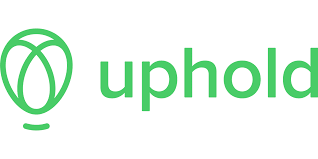

# Class_Ex2
  * Who are you? What is your background?
    Hello my name is Zeke Herrera. My background has nothing to do with fintech I am currently a server at a fine dining restaurant.

    * What are your career goals?
    My careers goals after completing the bootcamp is to get a job at a fintech company. I would like to get into a company that deals with blockchain.

    * Why did you choose FinTech as a career path?
    I choose fintech because I am interested in the stock market and creating tools to read and understand it better. I have also started to follow cryptourrency and have been interested in how they are developed. 

---

 #Class Example 3

 

#Next Example
 
